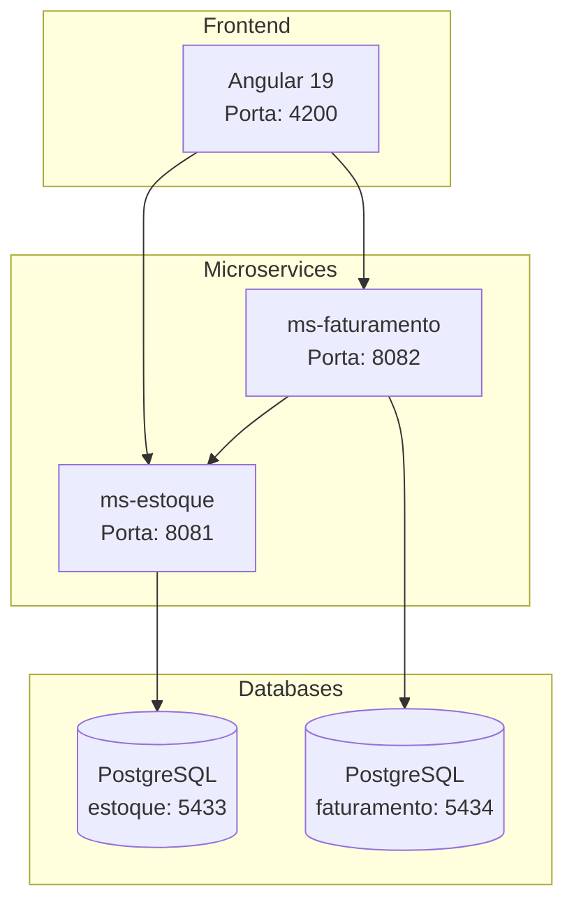

# Desafio tecnico Korp — Menoti Filho

##  Sistema de Emissao de Notas Fiscais

Sistema full-stack de emissao de notas fiscais com arquitetura de microsservicos,
desenvolvido com Angular 19, Go 1.23 e PostgreSQL 16.

## Funcionalidades

- Dashboard com informacoes rápidas sobre os serviços de faturamento e estoque
- CRUD de produtos (codigo, descricao, saldo)
- CRUD de notas fiscais com multiplos produtos e quantidades
- Impressao de notas com baixa automatica de estoque

## Arquitetura



O frontend se comunica diretamente com ambos os microsservicos. O
ms-faturamento chama o ms-estoque via HTTP para realizar a baixa de
estoque durante a impressao de notas.

## Como Rodar

### Pre-requisitos

- Docker e Docker Compose
- Git

### Passos

```bash
# Clonar o repositorio
git clone https://github.com/MenotiFilho/Korp_Teste_MenotiFilho.git
cd Korp_Teste_MenotiFilho

# Subir todos os servicos
docker compose -f infra/docker-compose.yml up -d --build
```

### URLs

| Servico | URL |
|---------|-----|
| Frontend | http://localhost:4200 |
| ms-estoque | http://localhost:8081 |
| ms-faturamento | http://localhost:8082 |

### Parar

```bash
docker compose -f infra/docker-compose.yml down
```

### Reiniciar apos mudancas no codigo

```bash
docker compose -f infra/docker-compose.yml up -d --build
```

O frontend usa hot reload — alteracoes no codigo do Angular sao refletidas
automaticamente via bind-mount.

## Estrutura de Pastas

```
Korp_Teste_MenotiFilho/
├── apps/
│   ├── frontend/           # Angular 19
│   ├── ms-estoque/         # Go — microsservico de estoque
│   └── ms-faturamento/     # Go — microsservico de faturamento
├── migrations/             # Scripts SQL
├── docker-compose.yml
├── detalhamento.md         # Detalhamento tecnico
└── README.md
```

## Testes

```bash
# Backend (ms-estoque)
cd apps/ms-estoque && go test ./...

# Backend (ms-faturamento)
cd apps/ms-faturamento && go test ./...

# Frontend
cd apps/frontend && npm test
```
